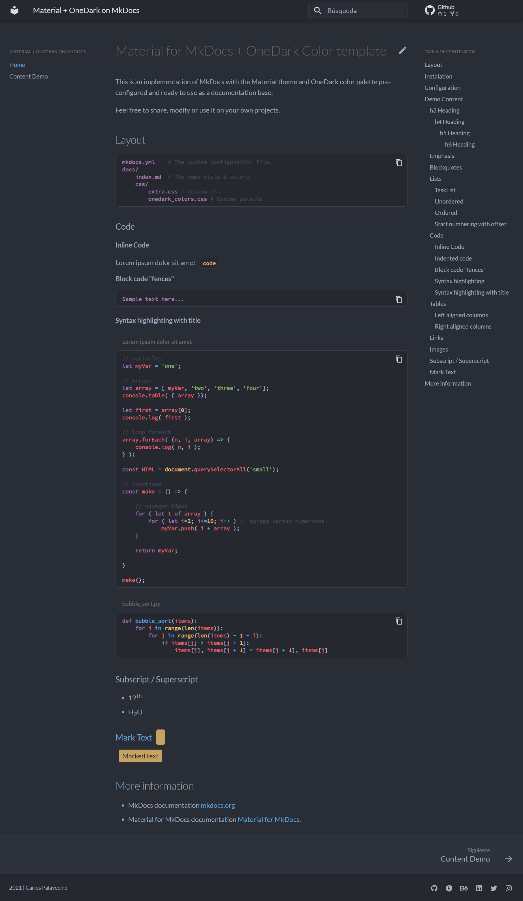
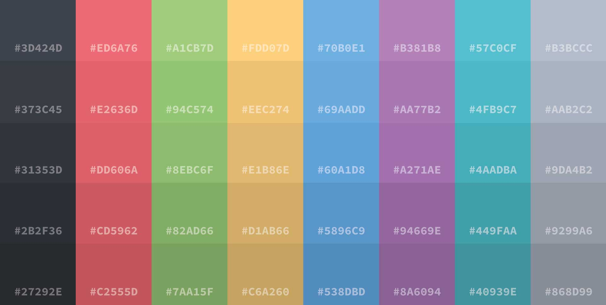

# Material for MkDocs + OneDark Color template

This is an implementation of MkDocs with the Material theme and OneDark color palette pre-configured and ready to use as a documentation base.

Feel free to share, modify or use it on your own projects.

``` bash
mkdocs new my-project # Create project
pip install mkdocs-material # install material theme
pip install mkdocs-autolinks-plugin # autolinks plugin
mkdocs serve # live preview
mkdocs build # build site
mkdocs gh-deploy # Deploy GitHub Pages
```

## Preview 

[Material + OneDark on MkDocs online preview](https://carlospalavecino.github.io/MaterialOneDarkOnMkDocs/)



## OneDark Palette



## Layout

```bash
mkdocs.yml    # The custom configuration file.
docs/
    index.md  # The demo style & colors.
	css/
		extra.css # Custom css
		onedark_colors.css # Custom palette
```

## Instalation
``` bash
// TODO: Install
```
## Configuration
``` yaml title="mkdocks.yml"
# MkDocs.yml
# The YAML configuration file defines the settings
# for the entire site, including where pages are found, layout, markdown extensions,
# plugins, additional css and javascript, and much more
#
# The configuration parameters listed below are some examples and explainations of
# what can be set, but is not all-encompassing. Please see the MkDocs online user
# guide for a full breakdown of configuration

# Site Config
site_name: Material + OneDark on MkDocs 
site_description: A base template with Material theme and OneDark Palette for MkDocs
site_author: Carlos Palavecino
docs_dir: docs
site_dir: site
copyright: 2021 | Carlos Palavecino
# favicon: images/favicon.png

# GitHub Config
repo_name: 'Github'
repo_url: https://github.com/carlospalavecino/MaterialOneDarkOnMkDocs
edit_uri: edit/main/docs/ 

# Menu Config
nav:
  - Home: index.md
  - Content Demo: content-demo.md

# Theme Config
theme: 
  language: es
  name: material
  font:
    text: Lato
    code: Source Code Pro
  palette:
    scheme: MaterialOneDarkCustom
#  logo: docs/img/logo.png
  icon:
    repo: fontawesome/brands/github
  features:
#    - navigation.tabs
    - navigation.tabs.sticky
    - navigation.sections
    - navigation.expand
    - navigation.indexe
    - navigation.top
    - content.code.annotate
    - content.tabs.link

# Extra CSS
extra_css:
  - css/extra.css

# Markdown Config
markdown_extensions:
  - pymdownx.highlight:
      use_pygments: true
  - pymdownx.inlinehilite
  - pymdownx.superfences
  - pymdownx.snippets
  - pymdownx.critic
  - pymdownx.caret
  - pymdownx.keys
  - pymdownx.mark
  - pymdownx.tilde
  - pymdownx.tasklist:
      custom_checkbox: true

# Extra Config
extra:
  generator: false
#  homepage: https://example.com
  social:
    - icon: fontawesome/brands/github
      link: https://github.com/carlospalavecino
      name: squidfunk on Twitter
    - icon: fontawesome/brands/hackerrank
      link: https://www.hackerrank.com/carlospalavecino
    - icon: fontawesome/brands/behance
      link: https://behance.net/CarlosPalavecino
    - icon: fontawesome/brands/linkedin
      link: https://www.linkedin.com/in/carlospalavecino/
    - icon: fontawesome/brands/twitter
      link: https://twitter.com/ch4rlypal
    - icon: fontawesome/brands/instagram
      link: https://instagram.com/ch4rlypal
# Plugins 
plugins:
  - search
  - autolinks
```


## More information
- MkDocs documentation [mkdocs.org](https://www.mkdocs.org)
- Material for MkDocs documentation [Material for MkDocs](https://squidfunk.github.io/mkdocs-material).
