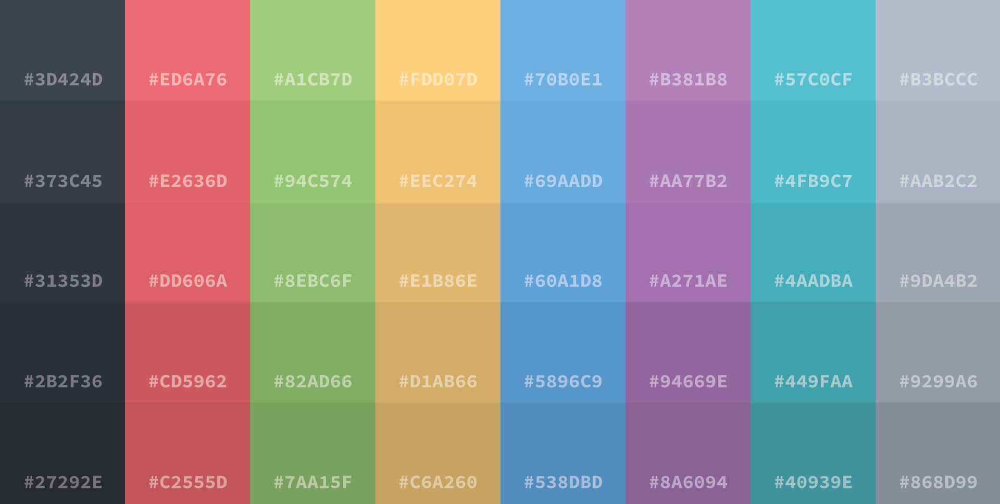

# Material for MkDocs + OneDark Color template
This is an implementation of MkDocs with the Material theme and OneDark color palette pre-configured and ready to use as a documentation base.

Feel free to share, modify or use it on your own projects.

## Preview 

[Material + OneDark on MkDocs online preview](https://carlospalavecino.github.io/MaterialOneDarkOnMkDocs/)


## OneDark Palette



## Layout

```bash
mkdocs.yml    # The custom configuration file.
docs/
    index.md  # The demo style & colors.
	css/
		extra.css # Custom css
		onedark_colors.css # Custom palette
```

## Instalation
``` bash
// TODO: Install
```
## Configuration
``` yaml title="mkdocks.yml"
# MkDocs.yml
# The YAML configuration file defines the settings
# for the entire site, including where pages are found, layout, markdown extensions,
# plugins, additional css and javascript, and much more
#
# The configuration parameters listed below are some examples and explainations of
# what can be set, but is not all-encompassing. Please see the MkDocs online user
# guide for a full breakdown of configuration

# Site Config
site_name: Material + OneDark on MkDocs 
site_description: A base template with Material theme and OneDark Palette for MkDocs
site_author: Carlos Palavecino
docs_dir: docs
site_dir: site
copyright: 2021 | Carlos Palavecino
# favicon: images/favicon.png

# GitHub Config
repo_name: 'Github'
repo_url: https://github.com/carlospalavecino/MaterialOneDarkOnMkDocs
edit_uri: edit/main/docs/ 

# Menu Config
nav:
  - Home: index.md
  - Content Demo: content-demo.md

# Theme Config
theme: 
  language: es
  name: material
  font:
    text: Lato
    code: Source Code Pro
  palette:
    scheme: MaterialOneDarkCustom
#  logo: docs/img/logo.png
  icon:
    repo: fontawesome/brands/github
  features:
#    - navigation.tabs
    - navigation.tabs.sticky
    - navigation.sections
    - navigation.expand
    - navigation.indexe
    - navigation.top
    - content.code.annotate
    - content.tabs.link

# Extra CSS
extra_css:
  - css/extra.css

# Markdown Config
markdown_extensions:
  - pymdownx.highlight:
      use_pygments: true
  - pymdownx.inlinehilite
  - pymdownx.superfences
  - pymdownx.snippets
  - pymdownx.critic
  - pymdownx.caret
  - pymdownx.keys
  - pymdownx.mark
  - pymdownx.tilde
  - pymdownx.tasklist:
      custom_checkbox: true

# Extra Config
extra:
  generator: false
#  homepage: https://example.com
  social:
    - icon: fontawesome/brands/github
      link: https://github.com/carlospalavecino
      name: squidfunk on Twitter
    - icon: fontawesome/brands/hackerrank
      link: https://www.hackerrank.com/carlospalavecino
    - icon: fontawesome/brands/behance
      link: https://behance.net/CarlosPalavecino
    - icon: fontawesome/brands/linkedin
      link: https://www.linkedin.com/in/carlospalavecino/
    - icon: fontawesome/brands/twitter
      link: https://twitter.com/ch4rlypal
    - icon: fontawesome/brands/instagram
      link: https://instagram.com/ch4rlypal
# Plugins 
plugins:
  - search
  - autolinks
```


## Demo Content
### h3 Heading
#### h4 Heading
##### h5 Heading
###### h6 Heading

### Emphasis

**This is bold text**

__This is bold text__

*This is italic text*

_This is italic text_

~~Strikethrough~~


### Blockquotes


> Blockquotes can also be nested...
> > ...by using additional greater-than signs right next to each other...
> >
> > > ...or with spaces between arrows.

### Lists

#### Unordered

+ Create a list by starting a line with `+`, `-`, or `*`
+ Sub-lists are made by indenting 2 spaces:
  - Marker character change forces new list start:
    * Ac tristique libero volutpat at
    + Facilisis in pretium nisl aliquet
    - Nulla volutpat aliquam velit
+ Very easy!

#### Ordered

1. Lorem ipsum dolor sit amet
2. Consectetur adipiscing elit
3. Integer molestie lorem at massa
1. You can use sequential numbers...
1. ...or keep all the numbers as `1.`

#### Start numbering with offset:

57. foo
1. bar


### Code
#### Inline Code
Lorem ipsum dolor sit amet `code`

#### Indented code

    // Some comments
    line 1 of code
    line 2 of code
    line 3 of code


#### Block code "fences"

```
Sample text here...
```

#### Syntax highlighting

``` js
var foo = function (bar) {
  return bar++;
};

console.log(foo(5));
```

#### Syntax highlighting with title
``` js title="Lorem ipsum dolor sit amet"
// variables
let myVar = 'one';

// Arrays
let array = [ myVar, 'two', 'three', 'four'];
console.table( { array });

let first = array[0];
console.log( first );

// loop foreach
array.forEach( (n, i, array) => {
    console.log( n, i );
} );

const HTML = document.querySelectorAll('small');

// Functions
const make = () => {

    // navegar tipos
    for ( let t of array ) {
        for ( let i=2; i<=10; i++ ) // agrega cartas numericas
            myVar.push( i + array );
    }
    
    return myVar;

}

make();
```

``` python title="bubble_sort.py"
def bubble_sort(items):
    for i in range(len(items)):
        for j in range(len(items) - 1 - i):
            if items[j] > items[j + 1]:
                items[j], items[j + 1] = items[j + 1], items[j]
```


### Tables
#### Left aligned columns

| Option | Description |
| ------ | ----------- |
| data   | path to data files to supply the data that will be passed into templates. |
| engine | engine to be used for processing templates. Handlebars is the default. |
| ext    | extension to be used for dest files. |

#### Right aligned columns

| Option | Description |
| ------:| -----------:|
| data   | path to data files to supply the data that will be passed into templates. |
| engine | engine to be used for processing templates. Handlebars is the default. |
| ext    | extension to be used for dest files. |

---

### Links

[link text](http://dev.nodeca.com)

[link with title](http://nodeca.github.io/pica/demo/ "title text!")

### Images


### Subscript / Superscript
- 19^th^
- H~2~O


### [Mark Text <mark>Mark</mark>](https://github.com/markdown-it/markdown-it-mark)

==Marked text==


## More information
- MkDocs documentation [mkdocs.org](https://www.mkdocs.org)
- Material for MkDocs documentation [Material for MkDocs](https://squidfunk.github.io/mkdocs-material).
